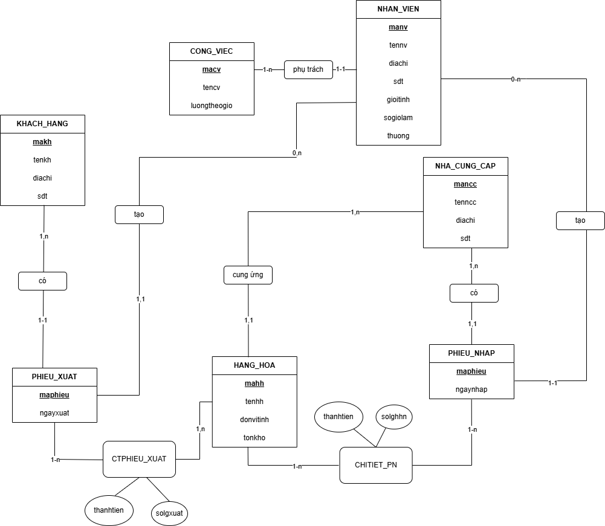

# 📦 Warehouse Management System – Electronics Distribution Company
## Description
This database system is designed to support the warehouse operations of an electronics distribution company. It manages the processes of importing and exporting goods, as well as tracking suppliers, customers, inventory, employees, and job roles.

## Data Structures
1. `Products`
- Fields: Product ID, Product Name, Unit, Supplier ID, Stock Quantity.
- Relation: One supplier can provide multiple products.

2. `Employees`
- Fields: Employee ID, Full Name, Address, Phone Number, Gender, Working Hours, Bonus, Job ID.
- Relation: Each employee is assigned to a single job in the warehouse.

3. `Jobs`
- Fields: Job ID, Job Title, Hourly Wage.

4. `Suppliers`
- Fields: Supplier ID, Supplier Name, Address, Phone Number.
- Relation: A supplier can be associated with multiple import receipts.

5. `Import Receipts`
- Fields: Receipt ID, Import Date, Supplier ID, Employee ID (Responsible).
- Details: Product ID, Quantity, Total Amount.
  
  **Note**: Only employees with the job "Warehouse Import" are allowed to create import receipts.

6. `Customers`
- Fields: Customer ID, Customer Name, Address, Phone Number.
- Relation: A customer can be associated with multiple export receipts.

7. `Export Receipts`
- Fields: Receipt ID, Delivery Date, Customer Name, Employee ID (Responsible).
- Details: Product ID, Quantity, Total Amount.
  
  **Notes**:
  - Only employees with the job "Warehouse Export" are allowed to create export receipts.
  - System checks inventory levels before processing any export.

## ERD
The following is the Entity-Relationship Diagram (ERD), which visualizes the structure and relationships among entities within the warehouse management system.

  

## Triggers

The system implements several database triggers to enforce business rules and maintain data integrity:
- `Trigger 1`:
  - Inventory update on import - export: Product stock quantity is automatically updated after each successful import - export.
  - Export quantity check: Exporting is not allowed if the requested quantity exceeds available stock.
- `Trigger 2` - Manager salary constraint: All employees must have an hourly wage lower than that of the manager.
- `Trigger 3` - Working hours limit: Each job position has a maximum allowed number of working hours.
- `Trigger 4` - Manager salary validation: The manager's hourly wage must be higher than any other employee.
- `Trigger 5` - Import/Export receipt restriction: Import and export receipts must be created only by employees assigned to the corresponding roles (Import or Export).
- `Trigger 6` - Date validation: Import and export dates must not be later than the current date.
- `Trigger 7` - Overtime pay calculation: Overtime pay is calculated as 1.5 times the regular hourly wage.
- `Trigger 8` - Job title validation: Job titles must be one of the following: "Security", "Export", "Import", "Manager", "Technician", "Service".
- `Trigger 9` - Unit validation: Product units must be one of the following: "Item", "Pair", "Set".
- `Trigger 10` - Phone number format: Phone numbers for employees, customers, and suppliers must consist of exactly 10 digits.

## Queries

Several SQL queries have been implemented to support data analysis and reporting. Examples include:
- `SQLQuery3` - Total import value by receipt ID in the year 2024: Retrieves the total amount of goods imported for each receipt within the year 2024.
- `SQLQuery5` - List of employees who confirmed imports in July 2024: Returns the names of employees responsible for completing import receipts during July 2024.
- `SQLQuery9` - Top 3 suppliers by total quantity of products supplied: Displays the supplier ID, supplier name, and total quantity of products supplied by the top 3 suppliers who have delivered the most items to the warehouse.

